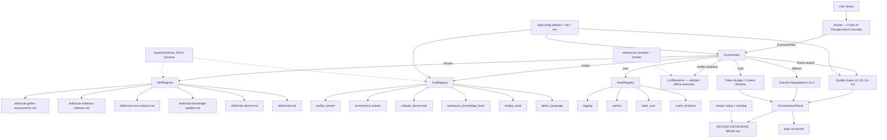

# System Architecture Diagram

> Render with any Mermaid viewer (GitHub, mermaid.live, VS Code Mermaid plugin).

## Module Map

| Layer | Module | Responsibility |
|-------|--------|---------------|
| Config | `gaming_tweaks.config` | Type-safe AppConfig (defaults + file + env). |
| Registry | `gaming_tweaks.registry` | Load / validate / resolve skills. |
| Router | `gaming_tweaks.router` | Chain-of-thought intent → ExecutionPlan. |
| Tools | `gaming_tweaks.tools` | JSON-Schema-gated tool registry. |
| Hooks | `gaming_tweaks.hooks` | Lifecycle / state-sync / event emission. |
| Orchestrator | `gaming_tweaks.orchestrator` | End-to-end execution loop. |
| Knowledge | `tools/knowledge_updater.py` | Academic + RSS crawl pipeline. |
| Domain pkg | `src/gaming_tweaks/*` | system_profiler, tweak_recommender, config_manager, benchmark_validator, cli. |
